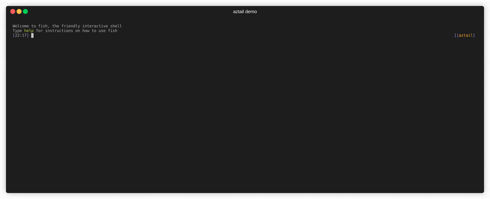

# aztail - cli to retrieve Azure logs


aztail is an opinionated tool to retrieve logs from Azure App Insights and Azure Monitor Logs (also known as Log Analytics). These services are exposed as databases, but when debugging, you typically want to retrieve a the logs as a stream. aztail retrieves records from these databases and presents them as a log stream, picking fields that are likely to be relevant for each particular service. It also allows you to "tail" a log stream.



Currently supported Azure services:

- Azure Functions
- Azure API Management
- Azure Container Apps

Several more services are in the works: see the [sources](./examples/README.md) page for details on how filters are applied and what data is retrieved.

Please understand that `aztail` is an opinionated debugging tool and not a generic Kusto client. It allows you to scan a log stream for relevant information, but as soon as you start asking "How often does this occur?", you should probably use the Azure Portal and formulate a proper Kusto query.

## Install

aztail is a single binary and can be downloaded from the repository [release page](https://github.com/bittrance/aztail/releases). aztail currently supports MacOS X, Linux and Windows x86-64. aztail depends on [Azure CLI](https://docs.microsoft.com/en-us/cli/azure/install-azure-cli) as it does not itself handle authentication, but expect you to have used `az login` and `az account set` to provide it with a session.

## Tutorial

This simple `aztail` query returns logs for the last two minutes and proceeds to periodically requests logs that are newer than those already seen. This will request logs from all services that `aztail` knows how to present.

```
aztail --app-id 45cb2850-a0ed-4a3f-b616-c5fa650951d9 --start-time='-2 min' --follow
```

You can pass filters to scope down what logs are returned. Filters are OR:ed together so this returns logs from all functions in two function apps, but no logs from e.g. API management.

```
aztail --workspace d5886821-9c0d-4f08-b2f3-d6621f15c6f8 --start-time='-2 min' --function-app this-app --function-app that-app --follow
```

Start and end times accept both [RFC3339](https://datatracker.ietf.org/doc/html/rfc3339) timestamps and colloquial time string, courtesy of [chrono-english](https://docs.rs/chrono-english/latest/chrono_english/) which tries to emulate the behavior of GNU date. This gives you logs for the last 24 hours.

```
aztail --workspace d5886821-9c0d-4f08-b2f3-d6621f15c6f8 --start-time='yesterday' --end-time='today'
```

If you want to explore the queries `aztail` asks, and the raw results that are returned, you can turn on debugging. Also useful when you want to report bugs.

```
aztail --workspace d5886821-9c0d-4f08-b2f3-d6621f15c6f8 --debug --follow
```

## Usage

```
Query tables in a App Insights or Log Analytics workspace and presents the result as a human-
readable log stream. When executed with only an App ID or Workspace ID, aztail retrieves logs from
all known services. If one or more filter arguments are used, only logs matching those filters will
be retrieved. Multiple filters can be used and will retrieve the union of matching data

USAGE:
    aztail [OPTIONS]

OPTIONS:
    -a, --app-id <APP_ID>
            The "Application ID" of the App Insight where logs reside

        --api-name <API_NAME>...
            Show only logs for a particular API

        --api-operation <API_OPERATION>...
            Show only logs for a particular operation (regardless of owning API)

        --container-group <CONTAINER_GROUP>...
            Show only logs for a container group

        --container-name <CONTAINER_NAME>...
            Show only logs for a specific container

        --debug
            Debug log all queries and all entries received

    -e, --end-time <END_TIME>
            Retrieve logs older than this. Can be RFC3339 or informal such as "30min ago"

    -f, --follow
            Tail a log query. Incompatible with --end-time

        --format <FORMAT>
            One of text, json [default: text]

        --function <FUNCTION>...
            Show only logs for a specific function

        --function-app <FUNCTION_APP>...
            Show only logs for a specific app

    -h, --help
            Print help information

    -s, --start-time <START_TIME>
            Retrieve logs newer than this. Can be RFC3339 or informal such as "yesterday"

    -V, --version
            Print version information

    -w, --workspace <WORKSPACE>
            The ID of the Log Analytics workspace where logs reside
```

## Developing

aztail is written in Rust and uses [cargo](https://doc.rust-lang.org/cargo/). Pushing a semver-compliant tag will trigger a release build.

## Contributing

Contributions are welcome. Please file an issue and/or a pull request.

## License

For the time being, aztail is licensed under [GPLv3](./LICENSE). If you have a use case that is hampered by this license, please file an issue.

## Credits

aztail is inspired by [awslogs](https://github.com/jorgebastida/awslogs).
